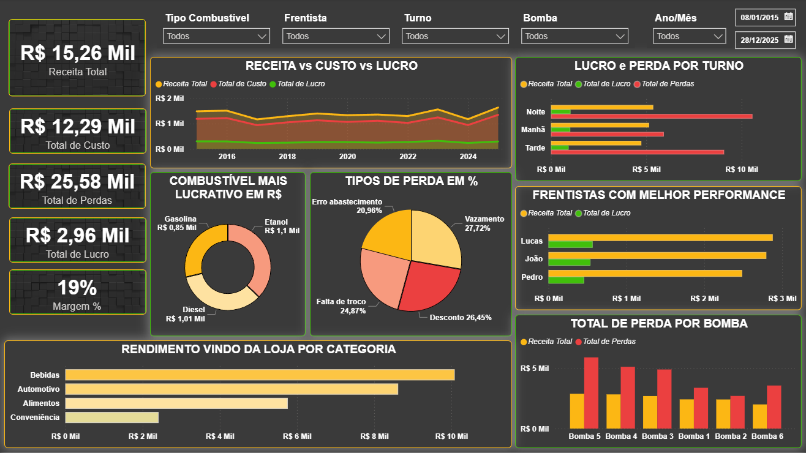
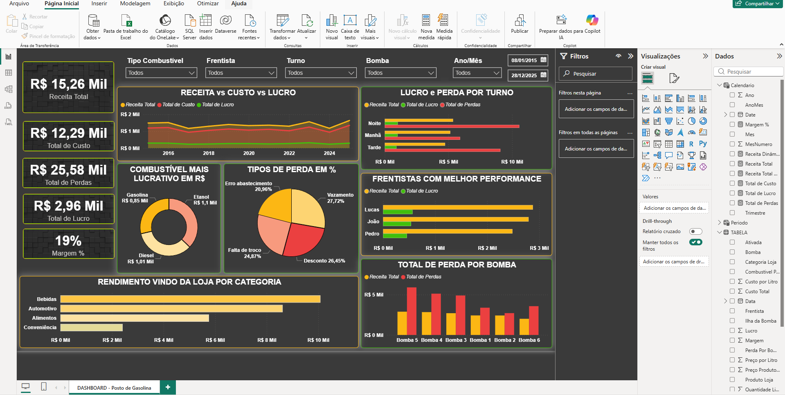

🚀 Dashboard de Controle de Combustível e Performance de Loja

🔹 Contexto:
Desenvolvi este dashboard para uma rede de postos de combustíveis, com o objetivo de monitorar receita, custo, lucro e perdas, além de analisar a performance da loja e dos frentistas.
O foco principal: gerar insights estratégicos para reduzir perdas, otimizar vendas e melhorar a operação.

---

🔹 Desafio:
Integrar dados de vendas de combustíveis e loja de conveniência em um único dashboard.
Visualizar métricas financeiras em tempo real e por período (mensal, trimestral e anual).
Identificar os tipos de perda mais recorrentes (erro de abastecimento, falta de troco, desconto, vazamento).
Comparar desempenho por frentista, turno e bomba de combustível.

---

🔹 Soluções Implementadas:
KPIs principais: Receita Total, Custo Total, Perdas, Lucro e Margem.
Visualizações avançadas:
Linha: receita, custo e lucro ao longo do tempo.
Barra: desempenho por frentista, turno, bomba e categoria da loja.
Pizza: combustível mais lucrativo e tipos de perda em porcentagem.
Filtros dinâmicos por tipo de combustível, frentista, turno, bomba e período.
Dashboard interativo, responsivo e de fácil leitura, permitindo decisões estratégicas rápidas.

---

🔹 Resultados e Insights:
Combustível mais lucrativo: Etanol (R$ 1,1 mil), seguido de Diesel e Gasolina.
Maior tipo de perda: Vazamento (27,72%), seguido de desconto, falta de troco e erro de abastecimento.
Monitoramento da performance individual de frentistas e turnos, permitindo ações de treinamento e incentivos.
Insights claros sobre rendimento da loja por categoria, destacando bebidas como maior fonte de receita.

---

🔹 Ferramentas Utilizadas:
Power BI: criação de dashboards interativos.
Excel / SQL: manipulação e tratamento de dados.
Design visual: cores e layouts estratégicos para facilitar análise rápida.
